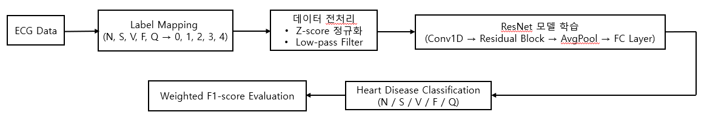
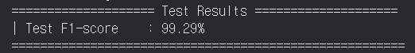
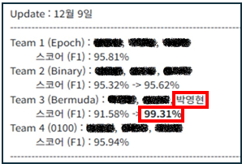
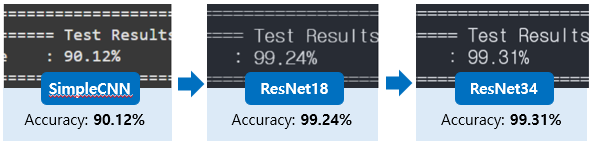
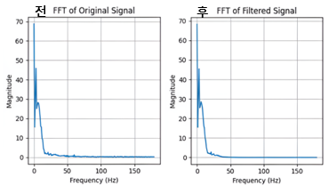
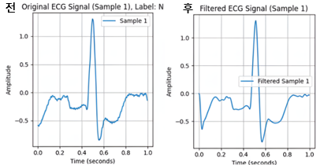

# ECG Multi-Class Classification Challenge

ECG(심전도) 데이터를 활용하여 심장 질환을 분류하는 딥러닝 모델을 개발한 프로젝트입니다.

## Project Overview

- 기간 : 2024.09 ~ 2024.12
- 인원 : 3명
- 목표 : ECG 신호 기반 심장 질환 다중 분류 모델 개발

### 담당 역할

- ResNet 기반 분류 모델 구현
- ECG 데이터 전처리
- Low-pass Filter(IIR, FIR) 적용
- 하이퍼파라미터 튜닝
- 모델 학습, 성능 평가

---

## Tech Stack

- Python
- PyTorch
- NumPy
- SciPy
- Scikit-learn
- Google Colab

---

## Architecture

ECG 신호 전처리 후 ResNet 기반 모델을 활용하여 심장 질환을 분류하였습니다.

---

## Performance

### 최종 성능

- Weighted F1-score : **99.29%**

### 대회 결과

- 비공개 Test Dataset 평가
- Weighted F1-score : **99.31%**

)

---

## Troubleshooting

### 1. 모델 구조 개선

기존 SimpleCNN 모델은 ECG 신호의 복잡한 패턴을 충분히 학습하는 데 한계가 있었습니다.

이에 따라 모델 구조를 다음과 같이 개선하였습니다.

- SimpleCNN → ResNet18 → ResNet34

모델별 성능을 비교하며 실험을 진행하였고, 최종적으로 ResNet34를 적용하여 성능을 향상시켰습니다.

---

### 2. Low-pass Filter 적용

ECG 신호에는 다양한 고주파 노이즈가 포함되어 있어 데이터 품질에 영향을 줄 수 있습니다.

이를 해결하기 위해 IIR/FIR 기반 Low-pass Filter를 적용하여 노이즈를 제거하고 성능 변화를 분석하였습니다.

#### FFT 비교

#### IIR Filter 적용 결과

---

## Dataset

대회 규정 및 데이터 용량 문제로 데이터셋은 저장소에 포함하지 않았습니다.
